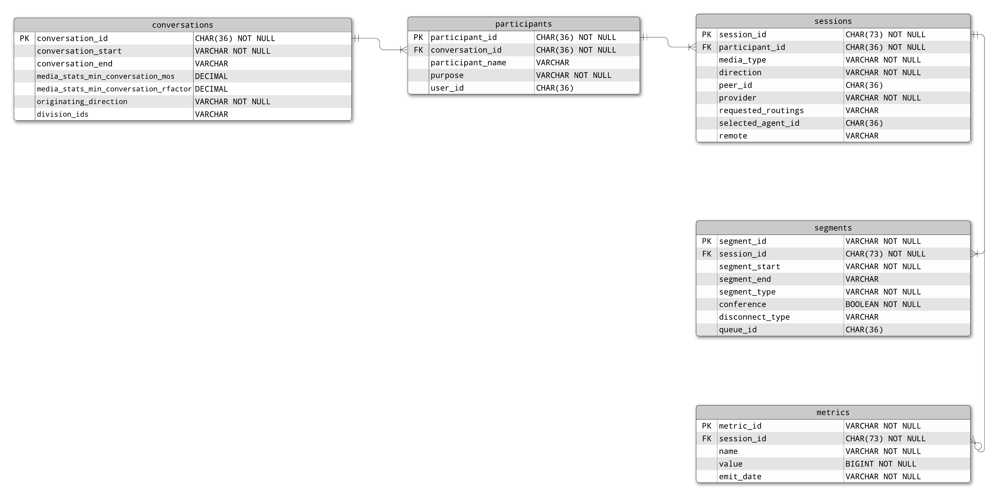

# Conversation model to SQL Blueprint

> View the full [Conversation model to SQL Blueprint](https://developer.genesys.cloud/blueprints/conversation-model-to-sql-blueprint/) on the Genesys Cloud Developer Center.

This Genesys Blueprint provides an example of how to design an SQL database for storing JSON data, specifically from the [POST 
/api/v2/analytics/conversations/details/query](https://developer.mypurecloud.com/api/rest/v2/analytics/#post-api-v2-analytics-conversations-details-query) endpoint.  
A project containing a dockerized postgres database and Node.js Typescript driver will be included as an example.

