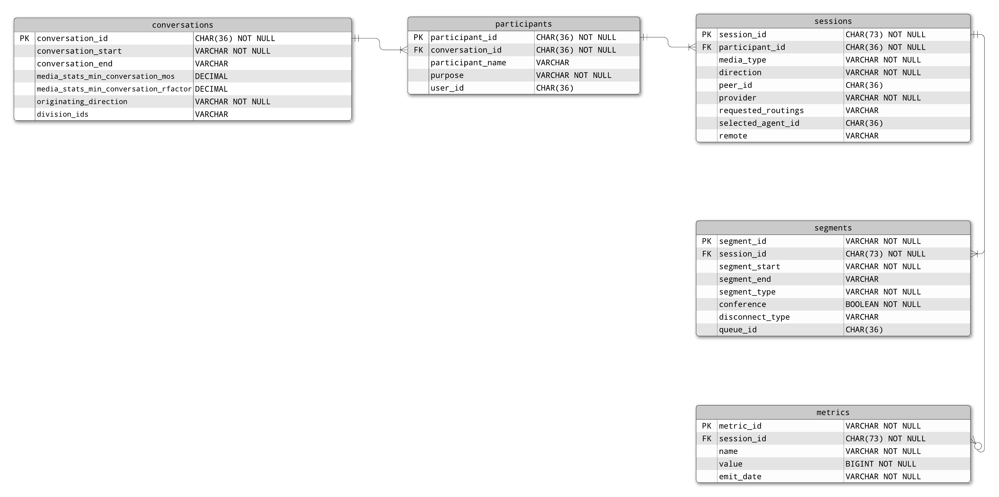

This Genesys Blueprint provides an example of how to design an SQL database for storing JSON data, specifically from the [POST /api/v2/analytics/conversations/details/query](/api/rest/v2/analytics/#post-api-v2-analytics-conversations-details-query) endpoint. A project containing a dockerized postgres database and Node.js Typescript driver will be included as an example.



## Solution components
* **Genesys Cloud** - A suite of Genesys cloud services for enterprise-grade communications, collaboration, and contact center management.
* **[PostgreSQL](https://www.postgresql.org/)** - An open source object-relational database system.
* **[Docker](https://www.docker.com/)** - A set of platform as a service products that use OS-level virtualization to deliver software in packages called containers. Recommended version: 19.0.0
* **[Docker Compose](https://docs.docker.com/compose/)** - A tool for defining and running multi-container Docker applications. Recommended version: 1.27.0
* **[Node.js](https://nodejs.org/en/)** - An open-source, cross-platform, back-end JavaScript runtime environment that runs on the V8 engine and executes JavaScript code outside a web browser. Recommended version: 15.0.0

## Software Development Kit (SDK)
* **Genesys Cloud Platform API SDK** - This SDK is used for sending requests to the conversations details endpoint to obtain data for writing into the database.

## Requirements

### Specialized knowledge
* SQL - This Blueprint uses PostgreSQL but knowledge of any SQL flavor will work
* Typescript or Javascript - The driver has been written in Typescript using the Node.js runtime environment
* Docker - Docker Compose has been used to simplify the interface with the docker container but an elementary knowledge of Docker would be helpful
* Genesys Cloud Platform API knowledge

### OAuth Credential Requirements

Client Credentials are used to authenticate with the Genesys Cloud API. The following permissions are required for making the call to [POST 
  /api/v2/analytics/conversations/details/query](/api/rest/v2/analytics/#post-api-v2-analytics-conversations-details-query)
* analytics:conversationDetail:view

## Database design

The challenge in this task is to flatten a JSON structure to allow it to be written to an SQL database. The general approach has been to extract nested objects into their own tables containing a primary key and a foreign key referencing the primary key of the object above it. Where a primary key wasn't readily available for the segments and metrics tables, they were created by combining the foreign key with 2 other values in order to make it unique.
Where structures are an array of strings, they have been stored in the database as a single string delimited by a comma. `divisionIds` and `requestedRoutings` are examples of this.

The tables created to store the conversation data are as follows:
* `conversations` - PK: conversation_id
* `participants` - PK: participant_id, FK: conversation_id
* `sessions` - PK: session_id, FK: participant_id
* `metrics` - PK: metric_id (session_id _ name _ value), FK: session_id
* `segments` - PK: segment_id (session_id _ segment_start _ segment_end), FK: session_id

The following is an example of a conversation that can be accepted by the database:

```{"language":"json"}
{
    "conversationId": "1bc96a39-6725-40c4-9345-db72aa67b8c6",
    "conversationStart": "2021-04-01T12:27:53.386Z",
    "conversationEnd": "2021-04-01T12:43:23.306Z",
    "originatingDirection": "inbound",
    "divisionIds": [
        "1b6b98a6-3d70-47be-9406-61a5aa8cc570"
    ],
    "participants": [
        {
            "participantId": "8d4f84b1-3edb-4d4e-9665-4ae6a0af6147",
            "participantName": "John Doe",
            "purpose": "customer",
            "sessions": [
                {
                    "mediaType": "chat",
                    "sessionId": "4d3a7227-6fdc-4d60-97fe-99db88e00b51",
                    "direction": "inbound",
                    "segments": [
                        {
                            "segmentStart": "2021-04-01T12:27:53.386Z",
                            "segmentEnd": "2021-04-01T12:43:23.303Z",
                            "queueId": "a623d83c-96d7-4baa-af1f-d46ad6700d8b",
                            "disconnectType": "timeout",
                            "segmentType": "interact",
                            "conference": false
                        }
                    ],
                    "metrics": [
                        {
                            "name": "nConnected",
                            "value": 1,
                            "emitDate": "2021-04-01T12:27:53.386Z"
                        }
                    ],
                    "provider": "Webchat Provider",
                    "requestedRoutings": [
                        "Standard"
                    ],
                    "usedRouting": "Standard",
                    "selectedAgentId": "50fcd33c-f432-4726-abc9-979f3ca01555"
                }
            ]
        },
        {
            "participantId": "9791b7b2-8b76-40bb-8e8e-b218aacb3ea4",
            "participantName": "Yuri",
            "purpose": "acd",
            "sessions": [
                {
                    "mediaType": "chat",
                    "sessionId": "6acbee65-80be-4777-be03-8dacd07ee3f9",
                    "direction": "inbound",
                    "peerId": "4d3a7227-6fdc-4d60-97fe-99db88e00b51",
                    "segments": [
                        {
                            "segmentStart": "2021-04-01T12:27:53.388Z",
                            "segmentEnd": "2021-04-01T12:28:04.567Z",
                            "queueId": "a623d83c-96d7-4baa-af1f-d46ad6700d8b",
                            "disconnectType": "transfer",
                            "segmentType": "interact",
                            "conference": false
                        }
                    ],
                    "metrics": [
                        {
                            "name": "nOffered",
                            "value": 1,
                            "emitDate": "2021-04-01T12:27:53.388Z"
                        },
                        {
                            "name": "tAcd",
                            "value": 11179,
                            "emitDate": "2021-04-01T12:28:04.567Z"
                        }
                    ],
                    "provider": "Webchat Provider",
                    "remote": "John Doe",
                    "requestedRoutings": [
                        "Standard"
                    ],
                    "selectedAgentId": "50fcd33c-f432-4726-abc9-979f3ca01555"
                }
            ]
        },
        {
            "participantId": "ce60611f-07c6-4d57-9539-b8b26abe9f3a",
            "userId": "50fcd33c-f432-4726-abc9-979f3ca01555",
            "purpose": "agent",
            "sessions": [
                {
                    "mediaType": "chat",
                    "sessionId": "b9ea3521-176e-4916-af7d-240732fc4680",
                    "direction": "inbound",
                    "peerId": "4d3a7227-6fdc-4d60-97fe-99db88e00b51",
                    "segments": [
                        {
                            "segmentStart": "2021-04-01T12:27:53.519Z",
                            "segmentEnd": "2021-04-01T12:28:04.569Z",
                            "queueId": "a623d83c-96d7-4baa-af1f-d46ad6700d8b",
                            "segmentType": "alert",
                            "conference": false
                        },
                        {
                            "segmentStart": "2021-04-01T12:28:04.569Z",
                            "segmentEnd": "2021-04-01T12:34:19.130Z",
                            "queueId": "a623d83c-96d7-4baa-af1f-d46ad6700d8b",
                            "segmentType": "interact",
                            "conference": false
                        },
                        {
                            "segmentStart": "2021-04-01T12:34:19.130Z",
                            "segmentEnd": "2021-04-01T12:43:23.306Z",
                            "queueId": "a623d83c-96d7-4baa-af1f-d46ad6700d8b",
                            "disconnectType": "peer",
                            "segmentType": "hold",
                            "conference": false
                        }
                    ],
                    "metrics": [
                        {
                            "name": "tAlert",
                            "value": 11050,
                            "emitDate": "2021-04-01T12:28:04.569Z"
                        },
                        {
                            "name": "tAnswered",
                            "value": 11179,
                            "emitDate": "2021-04-01T12:28:04.569Z"
                        }
                    ],
                    "provider": "Webchat Provider",
                    "remote": "John Doe",
                    "requestedRoutings": [
                        "Standard"
                    ],
                    "usedRouting": "Standard",
                    "selectedAgentId": "50fcd33c-f432-4726-abc9-979f3ca01555"
                }
            ]
        }
    ]
}
```

## Important notes

The database design used in this blueprint will not store the full schema from the [POST 
  /api/v2/analytics/conversations/details/query](/api/rest/v2/analytics/#post-api-v2-analytics-conversations-details-query) response, some of the data was omitted to simplify the design. The full schema can be seen at the `200 - successful operation` section of the API documentation.  

The following steps outline how to get driver script running to show this design in action. It is intended as a possible starting point for developers looking to map conversation responses or other non-flat JSON data to SQL. This logic is not limited to typescript, people looking to access the SQL queries can find them in [db.ts](https://github.com/GenesysCloudBlueprints/conversation-model-to-sql-blueprint/blob/main/src/db.ts).  

## Implementation steps

[toc]

### Clone the repository containing the project files

1. Clone the [Conversation model to SQL Blueprint](https://github.com/GenesysCloudBlueprints/conversation-model-to-sql-blueprint "Opens the conversation-model-to-sql-blueprint repository in GitHub") repository.

### Create a Client Credentials OAuth Grant for Genesys Cloud

1. If you don't already have Client Credentials containing a role with the required permissions, log in to your Genesys Cloud organization and create a new OAuth client that uses a Client Credentials Grant a suitable role. For more information, see [Create an OAuth client](https://help.mypurecloud.com/articles/create-an-oauth-client/ "Opens the Create an OAuth client article") in the Genesys Cloud Resource Center.
2. In your local blueprint repository, open the [config.ts](https://github.com/GenesysCloudBlueprints/conversation-model-to-sql-blueprint/blob/main/src/config.ts) file. Add the client ID and secret from your OAuth client and specify the region where your Genesys Cloud organization is located, for example, `mypurecloud.ie` or `mypurecloud.com.au`.

### Start the docker container

1. From the [docker](https://github.com/GenesysCloudBlueprints/conversation-model-to-sql-blueprint/tree/main/docker) directory, run the following command:

```
docker-compose up
```

The docker container will now be running and the logs from it will be printed to the terminal. A directory named `datadir` will have been created. This is where the docker container will write the database data in order to persist it between invocations.  
The docker container can be left running in this terminal.

### Install the node dependencies

1. Run the following command to install `ts-node` globally if it is not already installed:

```
npm i ts-node -g
```

2. From the root of the project, run the following command to install the dependencies:

```
npm i
```

### Create the database tables

1. Open the [config.ts](https://github.com/GenesysCloudBlueprints/conversation-model-to-sql-blueprint/blob/main/src/config.ts) file. Add your local IP address to the `postgreSQL.host` section. Instructions for obtaining your local IP Address on macOs and Linux are available in a comment in the file.  
If you have chosen to change the `environment` or `ports` values in [docker-compose.yml](https://github.com/GenesysCloudBlueprints/conversation-model-to-sql-blueprint/tree/main/docker/docker-compose.yml) you must update their corresponding values in the config file.
2. From the root of the project, run the following command to create the database tables:

```
npm run create-tables
```

If successful, the output of the command will indicate that the tables have been created successfully.  
The script will output an `ECONNREFUSED` error if it can't establish a database connection. This is either because the docker container isn't running, or the IP address is incorrect.

### Insert some sample data

1. Run the following command to insert the [sample conversations](https://github.com/GenesysCloudBlueprints/conversation-model-to-sql-blueprint/tree/main/conversations) into the database:

```
npm run insert-data
```

The script should print "Conversations inserted successfully" if there are no errors.

### Fetch the data and compare

1. Run the following command to fetch the conversations from the database and check them for equality against their sources from the JSON files:

```
npm run compare-conversations
```

The output of the script should indicate that the conversations in the files are equal to the conversations in the database.

### Invoke the analytics conversations details API

1. The following command can be ran to make an API call to [POST 
/api/v2/analytics/conversations/details/query](/api/rest/v2/analytics/#post-api-v2-analytics-conversations-details-query) and insert the response data into the database.  
The command takes a to and from date in ISO-8601 format. These dates must be no more than 1 week apart.

```
npm run invoke-api [from_date] [to_date]
```

Example:

```
npm run invoke-api 2021-03-03T00:00:00.000Z 2021-03-09T00:00:00.000Z
```

The command will output the conversationIds of the conversations it is writing to the database, or will indicate that no conversations were available for the given range.

**Note** Inserting conversations with duplicate conversationIds will result in a duplicate key value error.

### Fetch a conversation by ID

1. Run the following command with a valid conversationId to fetch a conversation from the database:

```
npm run fetch-conversation [conversation_id]
```

Example:

```
npm run fetch-conversation 1bc96a39-6725-40c4-9345-db72aa67b8c6
```

The conversation will be printed to the console, or an error will indicate that no conversation with that ID is present in the database.

## Additional resources

* [PostgreSQL Documentation](https://www.postgresql.org/docs/ "Opens the PostgreSQL Documentation page")
* [Analytics Query Builder](/developer-tools/#/analytics-query-builder "Opens the Genesys Cloud Analytics Query Builder")
* [Docker Overview](https://docs.docker.com/get-started/overview/ "Opens the Docker Overview page")
* [Node.JS Homepage](https://nodejs.org/en/ "Opens the Node.JS homepage")